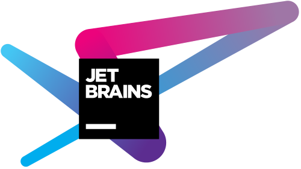

# Ogma

Readme (and the software itself) under construction. Expect it to
contain something when the code itself is ready for prime time.

# License

[GPL-3](LICENSE.md) until release. Then, most probably, MIT.

# Acknowledgements

Thank you, JetBrains, for providing us with an open-source
license for your products 💜

